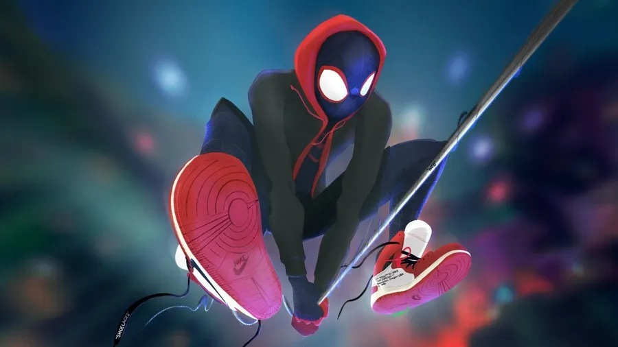
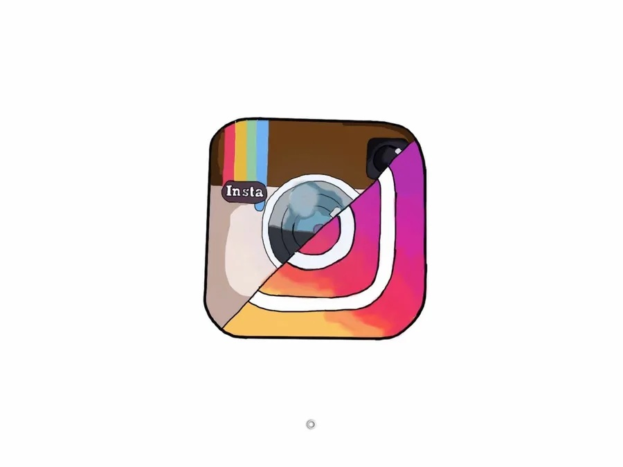

# PEC3_Manovich_Reloaded

### PEC3 de Cultura Digital de la UOC

Autor: Jose Orriols Rosado

Asignatura: Cultura Digital 

Grado: Multimedia

Fecha: 15-05-2026

## Planteamiento

La **hibridación de medios** es un concepto clave en la teoría de la cultura digital en autores como **Lev Manovich**. 
Se refiere al proceso por el cual diferentes medios (imagen, texto, vídeo, sonido, etc...) se combinan e integran dentro de un mismo entorno gracias al software dando lugar a nuevas formas culturales.
He llegado a la conclusión de que no se trata solo de mezclar cosas, sino que existe una integración profunda (no es poner un medio al lado del otro sin más) creando una nueva experiencia o lenguaje y el software es quien actua permitiendo esa unión.
Ahora he empezado a ver el software en vez de como una herramienta como un metamedio donde los lenguajes se fusionan pudiendo manipular datos y combinarlos libremente. 
En resumen, la hibridación de medios no consiste unicamente en la coexistencia de distintos formatos, sino en su integración dentro de un sistema común que genera nuevas formas de producción.

La hibridación de medios se reconoce cuando existe una integración real donde los medios no están separados sino fusionados como un único sistema. 
Se puede reconocer cuando se genera algo que no existía antes como medio independiente percibiendo el usuario un todo como una única experiencia y no como partes separadas.

Lo distingo de la **multimedia** porque en ésta simplemente coexisten varios medios juntos siendo cada uno independiente, pudiendo decir que se suman medios separados. En cambio en la hibridación los medios se fusionan integrándose unos con otros completamente.
A su vez lo distingo también de la **remediación**  porque ésta interpreta o representa a otro medio simulando o imitándolo, pudiendo decir que se adaptan medios. En cambio la hibridación combina medios creando otro nuevo.

Respecto a mis casos escogidos la elección responde a la intención de analizar dos formas muy diferenciadas pero complementarias de hibridación mediática en el contexto del software contemporáneo como plantea Lev Manovich.

**Caso 1: Spider-Man: un nuevo universo**

**Caso 2: Instagram**

Aplicando lo explicado hasta ahora en el caso 1 existe una hibridación que combina cine+comic y en el caso 2 es otro claro ejemplo de hibridación de varios medios integrados en la plataforma social.

## Reinterpretando Spider-Man: un nuevo universo: Caso 1

  

> *Imagen 1. Wallpaper de Spider-Man: Un nuevo universo. Tipo de licencia Free. Autor: casey77. URL: https://es.wallpapers.com/fondos-de-pantalla/fondode-pantalla-en-alta-definicion-de-spider-man-un-nuevo-universo-0e3cgsff6fzyb359.html  .*

Si me paro a analizar la película ya no se trata solo de una adaptación cinematográfica o mezcla de medios (cómic+animación) sino que se construye un **nuevo lenguaje híbrido** específico de la imagen en movimiento digital.
La película no adapta simplemente recursos del cómic sino que los reconfigura dentro del tiempo y el movimiento traduciendo un lenguaje estático del cómic a otro dinámico del cine. Es como que el software permite el movimiento del cine y la estática del comic de forma simultánea.

El nuevo lenguaje lo construyen entre otros varios elementos concretos:
- Animación o movimiento a diferentes FPS de los personajes
- Onomatopeyas integradas en la acción
- Composición híbrida dividiendo la pantalla como si fueran viñetas

Y es aquí donde entra el papel del software permitiendo convertir todo en datos manipulables combinando técnicas que serían incompatibles en medios tradicionales.

En conclusión para el caso concreto de **Spider-Man: un nuevo universo** la hibridación no se limita a combinar medios ya existentes sino que se construye un nuevo lenguaje visual de la imagen en movimiento.
A través del uso del software la película reconfigura elementos típicos del cómic que eran estáticos.

## Reinterpretando Instagram: Caso 2

  

> *Imagen 2. Wallpaper de Instagram. Tipo de licencia Free. Autor: marvin. URL: https://es.wallpapers.com/fondos-de-pantalla/logotipoantiguo-y-nuevo-de-instagram-wmhdhqicl8y6nk32.html   .*

En el caso de Instagram como usuario he sido testigo de su evolución. 
Didamos que no hay solo hibridación sino que también existe remediación unido a una evolución hacia nuevas formas híbridas.
Instagram remedia la fotografía analógica convirtiéndola en imagen digital editable, el álbum fotográfico transformándolo en feed, el vídeo amateur en reels o stories, etc...

Lev Manovich dice que ya no solo remedia sino que evoluciona hacia una hibridación integrando imagen más vídeo más música más interacción dentro de una misma interfaz generando al usuario una experiencia unificada.

Pero lo podemos extender aún más realizando una **yuxtaposición** de nuevos medios añadiendo por ejemplo:
- **Reels** que introducen edición de vídeo integrada, música sincronizada y lógica de algoritmos. No solo remedian sino que añaden nuevos medios dentro del sistema.
- **AR/VR** como filtros de realidad aumentada que son capaces de modificar el rostro en tiempo real integrando lo digital en lo físico. Se añaden nuevas capas de desarrollo hacia VR que antes no existían en fotografía o vídeo tradicional.

Para mi Instagram es el ejemplo perfecto donde ocurre un proceso mixto, el origen se vería como remediación, la yuxtaposición añadiría nuevas capas o funciones y la hibridación las integraría en su totalidad.
Instagram es una caso evolutivo donde coexisten remediación, yuxtaposición e hibridación.

### Declaración de uso de IA

Para la elaboración de este repositorio y la creación del ensayo he utilizado ChatGPT(OpenAI) como apoyo en la estructura y formato de MarkDown y Github, contrastar información, buscar fuentes fiables además de casos de ejemplo.

### Valoración personal y Referencias/Bibliografía

Mi valoración personal es clara, el software ha dejado de ser invisible.
Después de definir ambos casos se observa que la hibridación de medios no se manifiesta de una única forma sino que puede adoptar distintas formas según el contexto en el que aparece.
Pero en ambos casos el software ocupa un papel central ya que no solo actúa como herramienta técnica sino como un espacio donde diferentes lenguajes o formatos se reorganizan.

En el caso de Spider-Man la película no solo se limita a trasladar el cómic al cine sino que transforma recursos propios del cómic como viñetas u onomatopeyas en elementos integrados en la animación. El espectador experimenta una nueva forma visual.
Por otro lado Instagram incorpora nuevas capas como reels, filtros de realidad aumentada, stickers o algoritmos.

Ambos ejemplos confirman la idea de Lev Manovich de que el software ha transformado muy profundamente los medios actuales. No es solo una simple mezcla de medios sino una transformación dentro de sus límites y posibilidades.

+ Manovich, Lev. (2001). **El lenguaje de los nuevos medios**.
+ Manovich, Lev. (2013). **El Software toma el mando**. Barcelona: Editorial UOC.
+ Gea, M. (2022). _Herramientas y metodología crowdsourcing para la participación y creación colectiva de conocimiento abierto_. GitHub. https://github.com/mgea/CCpapers
+ Wikipedia. https://es.wikipedia.org/wiki/Spider-Man:_un_nuevo_universo 
+ OpenAI. (2026). *ChatGPT* [Thinking 5.3]. https://chat.openai.com/

----

Licencia: Material Creative Commons desarrollado bajo licencia CC BY-SA 4.0. Imágenes CC BY [Tubik studio](https://blog.tubikstudio.com/how-to-create-original-flat-illustrations-designers-tips/) 
